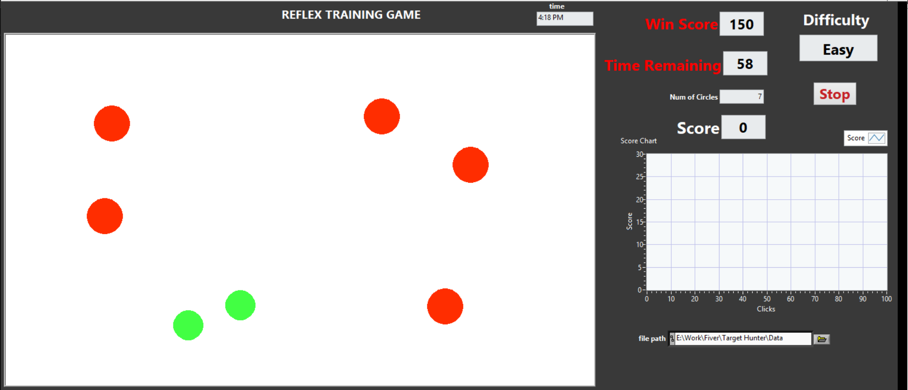

# Reflex Training Game (LabVIEW)

A small reaction-time game built in LabVIEW. Green targets appear on screen and
the player clicks them to score points while avoiding red distractors. The game
ramps through three difficulty levels inside a 60-second round. I built it as a
personal project to practice GUI design and event-driven programming in LabVIEW.

## How to play
- Click the GREEN targets to score points
- Avoid the RED distractors (clicking them costs you)
- The game gets harder across three difficulty levels
- You have 60 seconds per round; beat your best score

## Features
- Three progressive difficulty levels
- 60-second countdown timer
- Live score tracking
- Random target placement for replayability
- Clean, responsive GUI

## Screenshots

**Gameplay**

## Built with
- LabVIEW 2021
- Event-driven state machine architecture

## Skills demonstrated
LabVIEW, GUI Design, Event Structures, State Machine Architecture, Game Logic
